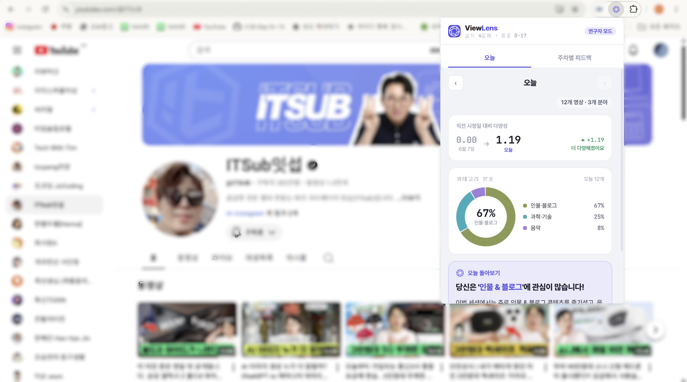
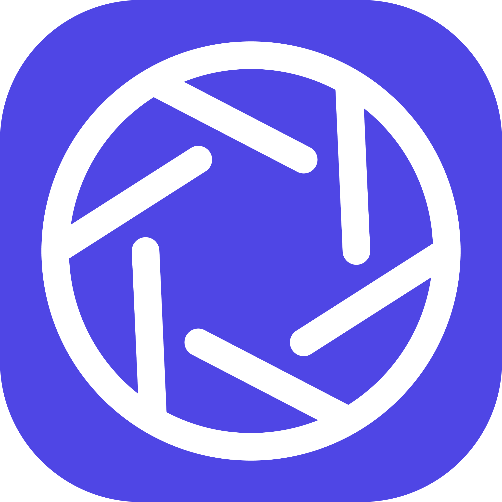

<p align="center">YouTube 시청 기록 기반 콘텐츠 소비 편향 피드백 Chrome 확장 프로그램</p>
<p align="center">Shannon Entropy로 시청 카테고리 다양성을 수치화하고, Gemini API로 자연어 피드백을 제공합니다.</p>

> 학술 연구 목적으로 개발된 시스템으로, 참여자는 연구자에게 받은 코드로 온보딩합니다.

---

## 기술 스택

| 영역          | 기술                                            |
| ------------- | ----------------------------------------------- |
| 확장 프로그램 | Chrome Extension Manifest V3                    |
| 분석          | Shannon Entropy, YouTube Data API v3            |
| 피드백        | Gemini 2.5 Flash API                            |
| 백엔드        | Node.js · Express 5 · better-sqlite3            |
| UI            | Vanilla JS · Pretendard · CSS Custom Properties |

---

## 시작하기

### 1. 저장소 클론

```bash
git clone https://github.com/your-org/youtube-bias-feedback.git
cd youtube-bias-feedback
```

### 2. 확장 프로그램 설정

```bash
cp extension/config.example.js extension/config.js
```

`extension/config.js`를 열어 서버 주소를 입력합니다. YouTube Data API 조회와 Gemini
피드백 생성은 모두 서버가 직접 처리하므로, 확장 프로그램에는 API 키가 필요 없습니다.

```js
export const SERVER_URL = "YOUR_SERVER_URL_HERE"; // 백엔드 서버 주소
```

### 3. Chrome에 확장 로드

1. `chrome://extensions` 접속
2. 우측 상단 **개발자 모드** 활성화
3. **압축 해제된 확장 프로그램을 로드합니다** → `extension/` 폴더 선택

### 4. 서버 실행

```bash
cd server
cp .env.example .env
npm install
npm run dev
```

서버는 기본적으로 `http://localhost:3000`에서 실행됩니다.

---

## 참여 그룹

확장 프로그램 설치 후 연구자에게 받은 코드를 입력해 온보딩합니다.

| 코드       | 설명                                       |
| ---------- | ------------------------------------------ |
| `EXP`      | 실험군 — 시청 분석과 Gemini 피드백 제공    |
| `CON`      | 대조군 — 피드백 없이 단순 시청 현황만 표시 |
| `TEST-EXP` | 연구자용 — 실험군 UI 미리보기              |
| `TEST-CON` | 연구자용 — 대조군 UI 미리보기              |

---

## UI 미리보기 (Studio)

`extension/studio/ViewLens.html`을 브라우저에서 직접 열면 Chrome 없이도 팝업 UI를 확인할 수 있습니다.  
우측 하단 **Tweaks** 패널에서 그룹·다크모드·실험 시점을 실시간으로 바꿔볼 수 있습니다.

<p align="center">
  
</p>

---

## 폴더 구조

자세한 내용은 [docs/04-폴더구조.md](docs/04-폴더구조.md)를 참고하세요.

```
youtube-bias-feedback/
├── extension/   # Chrome 확장 프로그램
│   ├── pipeline/    # 분석 파이프라인 (YouTube API · Gemini)
│   ├── popup/       # 팝업 UI
│   ├── studio/      # 브라우저 UI 미리보기 도구
│   └── assets/      # 폰트·아이콘
├── server/      # Node.js 백엔드 (Express + SQLite)
└── docs/        # 프로젝트 문서
```

---

## 데이터 수집 및 개인정보 보호

모든 서버 전송 데이터는 설치 시 생성된 **UUID(anonymousId)** 로만 연결되며, YouTube 계정 정보나 개인 식별 정보는 수집하지 않습니다.

| 데이터                        | 저장 위치   | 서버 전송        |
| ----------------------------- | ----------- | ---------------- |
| YouTube 계정 정보             | 수집 안 함  | ✕                |
| 영상 ID · 제목 · 시청 날짜    | 로컬 + 서버 | ✅ UUID로 익명화 |
| 일별 시청 수                  | 로컬 + 서버 | ✅ UUID로 익명화 |
| 카테고리 분포 비율            | 로컬 + 서버 | ✅ UUID로 익명화 |
| Shannon Entropy (일별·주차별) | 로컬 + 서버 | ✅ UUID로 익명화 |
| 자연어 리뷰                   | 로컬 + 서버 | ✅ UUID로 익명화 |
| 설문 응답                     | 서버        | ✅ UUID로 익명화 |

---

## API 키 발급

- **YouTube Data API v3**: [Google Cloud Console](https://console.cloud.google.com/) → API 및 서비스 → 사용 설정
- **Gemini API**: [Google AI Studio](https://aistudio.google.com/) → API 키 발급

<p align="center">
  
</p>
